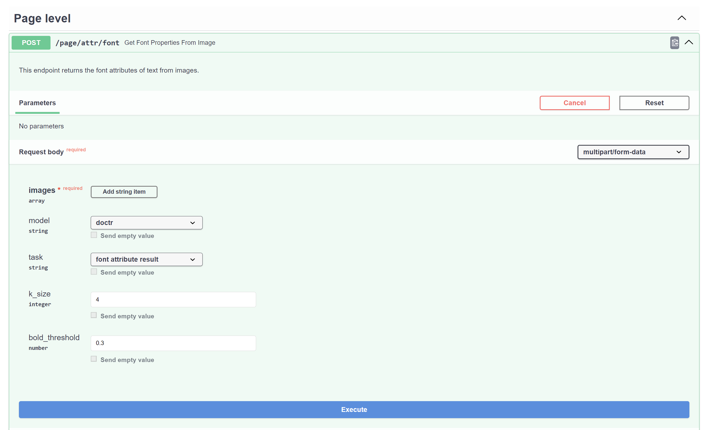

# Page Level Atrribute

## Font

- Input: Page Image
- Data Required by model: Image + Bounding Boxes of words
- Intermediate Step: Doctr/ Tesseract generates bounding boxes
- Result: Labeled Bounding Boxes / Visualisation Image

Example:
