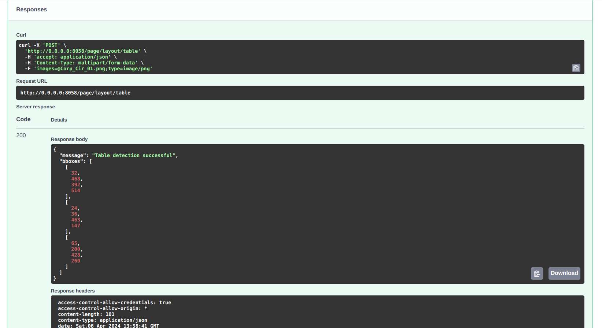
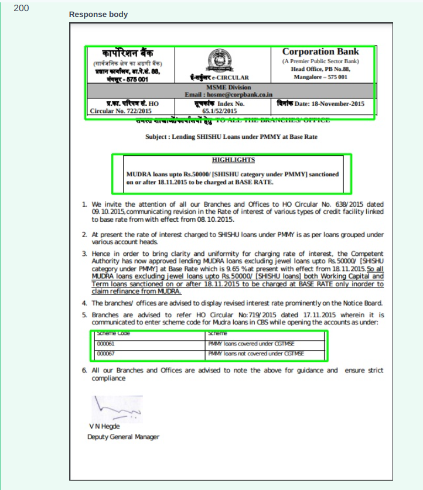

# IITB Table Detection

## Overview

Implementation of the Layout Parser API, designed for detecting tables within a document, providing comprehensive bounding box coordinates for the entire table. Implemented in docker. Processing code repository [here](https://github.com/iitb-research-code/docker-table-det), use to build docker image.

## API Endpoint and usage

Created a module server/modules/page/layout/iitb_v0_table to have the endpoint for table detection.

### Table Detection endpoint
- **/api/v0/page/layout/table** : Returns coordinates of BBoxes of the tables.
- **/api/v0/page/layout/table/visualize** : Returns annotated image displaying the detected tables.

### Input:
- An image file.

### Example

**Request image**


**Response image**



## Changes Made
### table_detection module
- Introduced table_detection module to detect and extract the Bounding Box information from images.

### routes.py
- Introduced `page/layout/table` as the primary endpoint for performing table detection.
- Introduced `page/layout/table/visualize` to perform visualization of the detected bounding boxes of the table.
- User inputs an images and a json response containing the success of table detection and bounding boxes for various tables is returned.

### helpers.py
- The `delete_files_in_directory` function is used to clear the contents of a directory before saving new files. 
- The `save_uploaded_images` function is implemented for saving uploaded images to a specified directory, replacing any existing files with the same names.
- The `visualize_bounding_boxes` function is used to visualize detected bounding boxes on the input image. 

### models.py
- The code snippet defines a Pydantic model named TableDetection, which is intended to represent an uploaded file for table detection. The purpose of this code is to create a structured way to handle uploaded files in FastAPI endpoints. 

In modules/page/__init__.py line 11 imported router from routes.py of the layout.

In app.py line 23 imported router of page.

### Requirements

No need for external requirements as docker container is used for running

## Input and Example JSON Response

**Input:**
- An image file.

**Example JSON Response for Successful Table Detection:**
```json
{
    "message": "Table Detection Successful",
      "bboxes": [
        [
            122,
            95,
            462,
            344
        ]
        // ... additional bounding boxes for tables
    ]    
}
```

**Example JSON Response for documents do not containing any table:**
```json
{
  "message": "No table detected",
  "bboxes": []
}
```