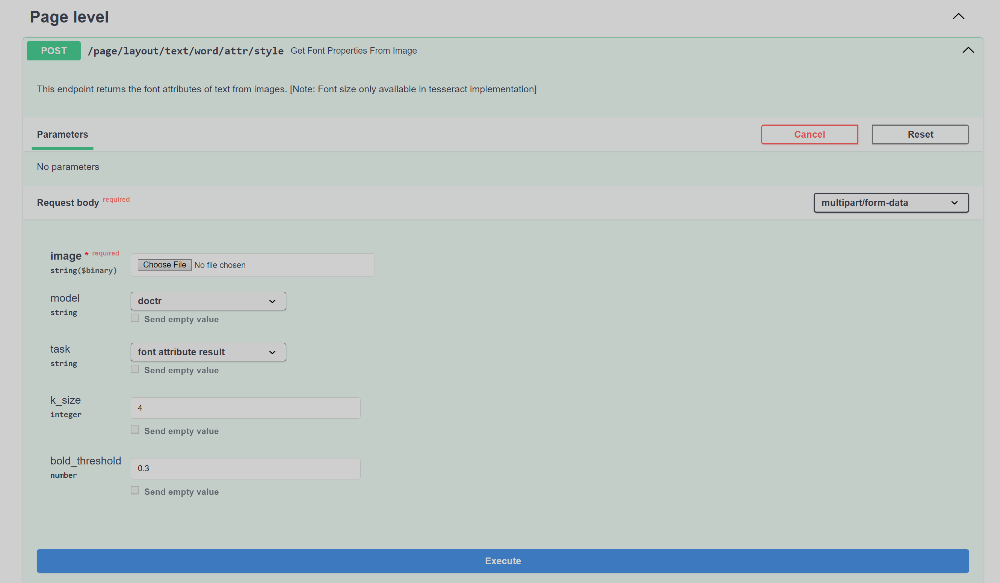
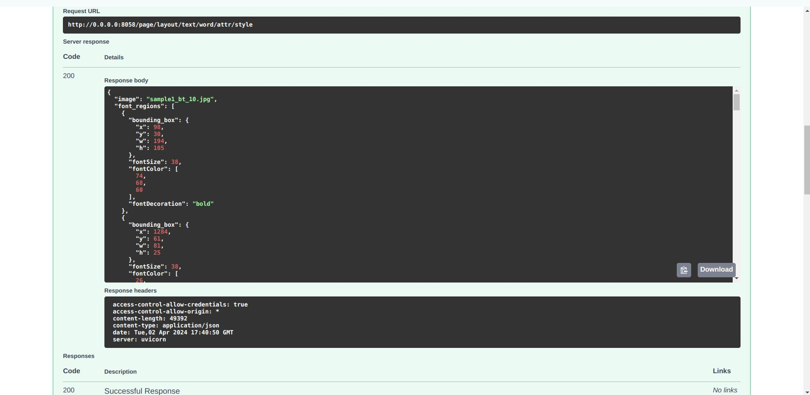
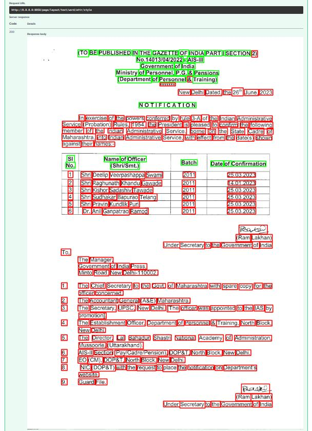

# IITB Text Attributes

An API endpoint designed for detecting font attributes of text in a document, providing bounding box coordinates for each word along with font weight, color and size. A visualization endpoint is also available to display bounding boxes for enhanced interpretability. Implemented in docker. Processing code repository [here](https://github.com/iitb-research-code/docker-text-attribute/tree/single-image), use to build docker image.

## API Endpoint and usage

Created a module server/modules/page/layout/text/word/attr/iitb_v0_style to have the endpoint for detection of font attributes.

**Text Attributes endpoint - /page/layout/text/word/attr/style**

**Input**

- Page Image
- Data Required by model: Image + Bounding Boxes of words
- Intermediate Step: Doctr/ Tesseract generates bounding boxes
- Result: Labeled Bounding Boxes / Visualisation Image

### Example
**Request image**

**Response image**

## Changes Integrated
### iitb_v0_style module
- The iitb_v0_style module has been introduced to centralize the code for detecting font attributes of text in a document, providing bounding box coordinates for each word along with font weight, color and size. 

### routes.py
- The endpoint `server/modules/page/layout/text/word/attr/style` has been introduced to return the font attributes or visualization for given images.

### helper.py
- The `save_uploaded_images` function is implemented for saving uploaded images to a specified directory, replacing any existing files with the same names.

### models.py
- Houses the class and methods to support the response output of the inference call.

In modules/page/layout/text/word/attr/iitb_v0_style/__init__.py line 9 imported router from routes.py of the iitb_v0_style.

In app.py line 26 imported router of page.

### Requirements

No need for external requirements as docker container is used for running

