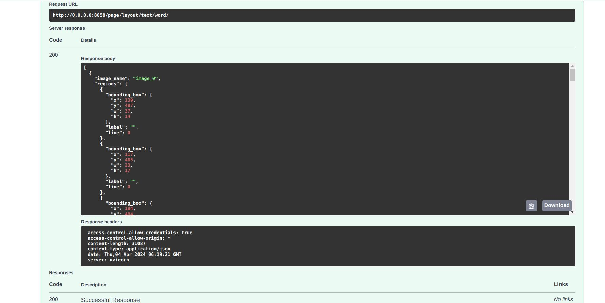
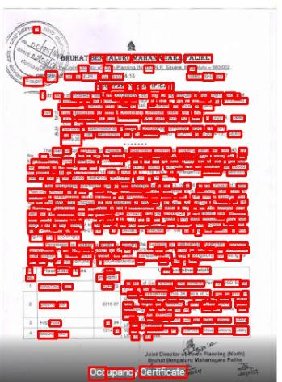

# IITB Textron
The module is used to detect text from the page level image using textron. Implemented in docker. Processing code repository [here](https://github.com/iitb-research-code/docker-textron), use to build docker image.

## API Endpoint and usage

Created a module server/modules/page/layout/text/word/iitb_v0_textron to have the endpoint for text detection using textron.

### Text Detection endpoint
- **/api/v0/page/layout/text/word** : Returns coordinates of BBoxes of the texts.
- **/api/v0/page/layout/text/word/visualize** : Displays the bounding box of the texts.

### Input:
- An image file.

### ***Note***
1. The Following Module downloads the required doctr models in the build image.
2. Update the docker Image Name in `/bhashini-ocr-api/server/modules/page/layout/text/word/textron/config.py` and IMAGE_DIR  in `/bhashini-ocr-api/server/modules/config.py`

### Example

**Request image**


**Response image**



## Changes Integrated
### iitb_v0_textron module
- The iitb_v0_textron module has been introduced to centralize the code for detecting text from the page level image using textron. 

### routes.py
- The endpoint `/api/v0/page/layout/text/word` has been introduced for Textron Inference that returns coordinates of BBoxes of the texts.
- The endpoint `/api/v0/page/layout/text/word/visualize` has been introduced for Textron Visualization that displays the bounding box of the texts.
- It implements the docker container and uses the helper function to return the output.

### helper.py
- Includes inference code and code for visualization.
- Saves uploaded images in a directory.
- Provides functions to delete files in a directory.
- Runs the Docker container.
- Extracts bounding boxes from 'out.json' (Docker output).
- Converts them into the response output for the response API.

### models.py
- Houses the class and methods to support the response output of the inference call.

### config.py: 
- Update the Name of the Docker Container.

### dependencies.py
- The `save_uploaded_images` function is implemented for saving uploaded images to a specified directory, replacing any existing files with the same names.


In modules/page/layout/text/word/attr/__init__.py line 11 imported router from routes.py of the iitb_v0_textron.

In app.py line 26 imported router of page.

### Requirements

No need for external requirements as docker container is used for running


## Load from Docker Hub
```
docker pull shouryatyagi222/textron:1
```
## Docker command used :
```
docker run --rm --net host -v IMAGE_FOLDER:/data textron:1
```