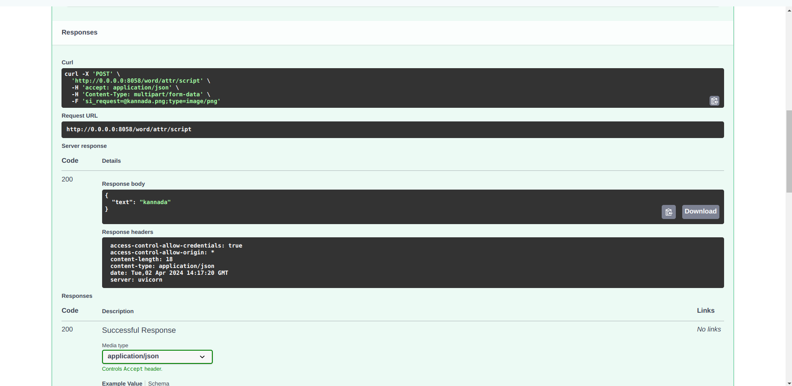

# IITB Script Detection

## Overview
This endpoint integration classifies the word-level images based on the script for 11 indic scripts. 
  ***Devanagari, Bengali, Gujarati, gurumukhi, Kannada, Malayalam, Odia, Tamil, Urdu, latin*** 
  Implemented in docker. Processing code repository [here](https://github.com/iitb-research-code/docker-script-identification/tree/single-word), use to build docker image.

## API Endpoint and usage

Created a module server/modules/word/attr/iitb_v0_script to have the endpoint for script detection using alexnet.

### Script Detection endpoint
- **/api/v0/word/attr/script** : Returns the detected script of the input word.

### Input:
- An image file of the word.

### Example

**Request image**

**Response image**

## Changes Integrated
### iitb_v0_script module
- The iitb_v0_script module has been introduced to centralize the code for classifying the word-level images based on the script for 11 indic scripts. 

### routes.py
- The endpoint `/api/v0/word/attr/script` has been introduced for recognizing the script.
- It implements the docker container and uses the helper function to return the output.

### helper.py
- The `save_uploaded_images` function is implemented for saving uploaded images to a specified directory, replacing any existing files with the same names.
- Defines functions for saving images and for processing output from output.json to response format

### models.py
- Contains class definition for response format.

In modules/word/attr/__init__.py line 9 imported router from routes.py of the iitb_v0_script.

In app.py line 27 imported router of word.

### Requirements

No need for external requirements as docker container is used for running
