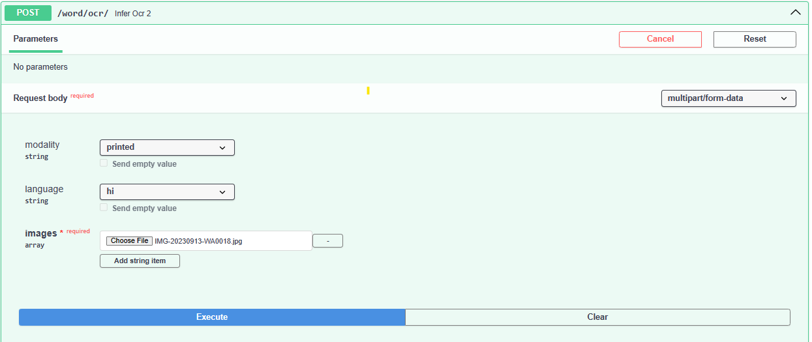

# Word Level Ocr
An API endpoint designed for OCR using Doctr Models for printed and handwritten. 
### EndPoint : /ocr/iitb/v2/
## Dockerization
For Dockerization refer this : `https://github.com/iitb-research-code/docker-basic-ocr`
## Docker Command Used
```
docker run --rm  --net host \
    -v MODEL_DIR:/root/.cache/doctr/models \
	-v MODEL_DIR:/models \
	-v DATA_DIR:/data \
	DOCKER_NAME \
	python infer.py -l LANGUAGE -t MODALITY
```
Where,
- MODEL_DIR: path to the models folder.
- DATA_DIR: path to the Image folder.
- DOCKER_NAME: name of you docker container.
- LANGUAGE: Name of the Language for the OCR.
- MODALITY: Printed/Handwritten.


## Note
- Refer to the README in the docker- repo directory for instructions on dockerization.
- Update the MODEL_FOLDER ,DOCKER_NAME, models_txt_path in config.py
- URLs added in ocr-api: /api/v0/word/ocr

## Example
#### Request

#### Response
```
{
  "output": [
    {
      "source": "நீரீபீத்தீ",
      "target": "ta"
    }
  ],
  "config": {
    "detectionLevel": "page",
    "modality": "printed",
    "languages": [
      {
        "sourceLanguageName": "tamil",
        "sourceLanguage": "ta"
      }
    ]
  }
}
```
## Author
- Name: Shourya Tyagi
- Email: shouryatyagi222@gmail.com